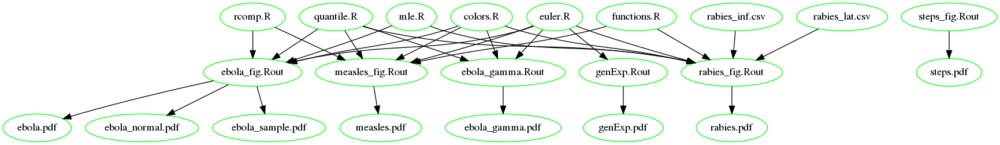

# A practical generation-interval-based approach to inferring the strength of epidemics from their speed

Each figure is generated by a single main R script:

- Figure 1: `steps_fig.R`
- Figure 2: `genExp.R`
- Figure 3: `ebola_fig.R`
- Figure 4: `measles_fig.R`
- Figure 5: `rabies_fig.R`
- Figure S1: `ebola_gamma.R`
- Figure S2: `ebola_fig.R`
- Figure S3: `ebola_fig.R`

Here is a dependency graph; the `.Rout` nodes correspond to the scripts which are run directly.

